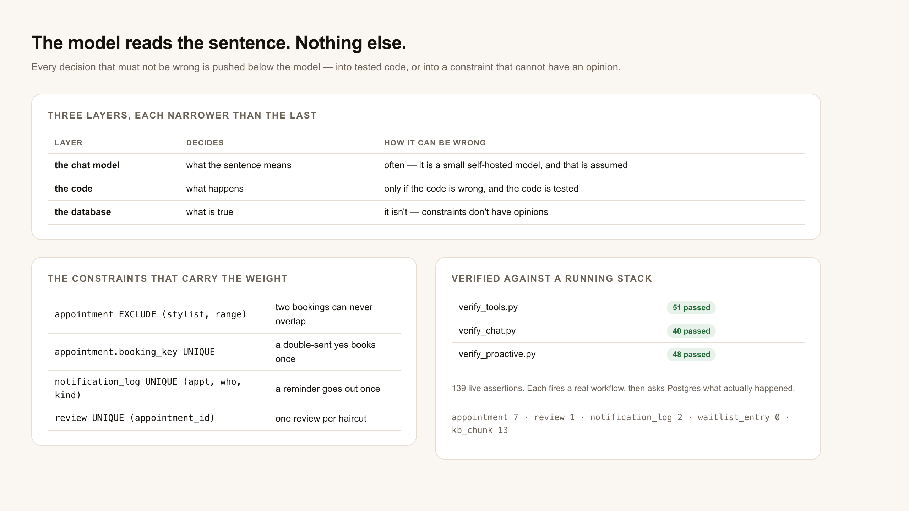

# Architecture

## The shape of it

```
   Telegram ──▶ 11 adapter ──▶ 10 Booking Agent Core ──┬──▶ 20 find availability ──┐
                (transport)      │                     ├──▶ 21 create booking      │
                                 │                     ├──▶ 22 cancel booking      ├──▶ Postgres
                                 │                     ├──▶ 23 find alternatives   │    (the rules)
                                 │                     ├──▶ 24 reassign booking    │
                                 │                     └──▶ 41 submit review ──────┘
                                 │
                    bge-m3 ◀─────┤ embed every message
                  pgvector ◀─────┤ retrieve salon notes (always, no tool to skip)
                 chat model ◀────┘ one call: read the sentence into a form

   schedulers ──▶ 30 reminders ────┐
                  31 backfill ─────┼──▶ 39 send a notice ──▶ notification_log ──▶ Telegram
                  40 ask a review ─┘        (claim, then send)

   stylist ────▶ 32 decline ──▶ 23 ──▶ asks the CLIENT ──▶ 24 on their yes
```

Three layers, each narrower than the last:

| Layer | Decides | How it can be wrong |
|---|---|---|
| the chat model | what the sentence means | often — it is a small model, and that is assumed |
| the code | what happens | only if the code is wrong, and the code is tested |
| the database | what is true | it isn't — constraints don't have opinions |

Everything consequential is pushed down a layer. The model cannot invent a stylist (names are
matched against the catalogue), quote a price (rendered from the row), pick a slot (a query), or
confirm anything (a server-side pending row plus the customer's literal "yes").



## Workflows

| # | Name | Trigger | What it does |
|---|---|---|---|
| 10 | Booking Agent Core | called by a channel | profile → embed → retrieve → one model call → deterministic routing → rendered reply |
| 11 | Channel: Telegram | schedule (poll) | transport only. Ships inactive — needs a bot token |
| 20 | tool: find availability | called | open slots for a service on a day, honouring hours, duration and existing bookings |
| 21 | tool: create booking | called | idempotent on a caller-supplied key; conflicts come back as a verdict, not an exception |
| 22 | tool: cancel booking | called | cancels and returns the freed window |
| 23 | tool: find stylist alternatives | called | who else performs it, works those hours and is free |
| 24 | tool: reassign booking | called | moves a booking, re-checking everything at the moment of the move |
| 30 | scheduled reminders | every 15 min | which notices are due and not already logged |
| 31 | cancellation backfill | every 5 min | a freed slot goes to whoever has waited longest |
| 32 | stylist decline → consent | called | finds cover, then asks the customer |
| 39 | send a notice | called | claims the right to send, then sends. The exactly-once guard |
| 40 | ask for a review | every 30 min | marks appointments complete, asks once, retries manager copies that never went |
| 41 | tool: submit review | called | stores one review, classifies it, routes praise and complaints to a human |
| 90 | dev test harness | webhook | calls any of the above by name. **Deactivate before deploying** |

Tools (20–24, 41) all answer with the same closed contract — `{ok:true,data}` or
`{ok:false,reason}`, never a thrown exception. Full input/output: [TOOL_CONTRACTS.md](TOOL_CONTRACTS.md).

## Schema

```
stylist ──┬── stylist_service ──┬── service
          │                     │
          ├── business_hours    │        appointment ───┬── review        (1 per appointment)
          │                     │         │             └── notification_log
          └─────────────────────┴─────────┤
                                 client ──┴── waitlist_entry
                                    │
                          bot_user_profile        (who we are TALKING to;
                                                   client is who has BOOKED)
```

Four constraints carry most of the weight:

| Constraint | Stops |
|---|---|
| `appointment` EXCLUDE on `(stylist_id, tstzrange(starts_at, ends_at))` WHERE confirmed | two confirmed appointments overlapping for one stylist — under any race, from any code path |
| `appointment.booking_key` UNIQUE | a double-sent confirmation becoming two bookings |
| `notification_log` UNIQUE `(appointment_id, recipient, recipient_ref, kind)` | a reminder going out twice. Keyed on the **person**, so a reassigned stylist still gets told |
| `review` UNIQUE `(appointment_id)` | two replies racing into two reviews of one haircut |

`tstzrange` defaults to a half-open `[)` range, so a 10:00–10:45 and a 10:45–11:30 booking sit
back to back without the constraint complaining.

## State that outlives a turn

`bot_user_profile.pending_booking` is the authorisation record. It holds one of:

| kind | Written by | A "yes" then means |
|---|---|---|
| `draft` | the agent, mid-slot-fill | nothing — it is just the answers so far |
| `book` | the agent's read-back, or a waitlist offer from 31 | create exactly this booking |
| `cancel` | the agent's cancel read-back | cancel exactly this appointment |
| `reassign` | 32, when a stylist declines | move it to exactly this replacement |
| `review` | 40, after an appointment completes | the reply is feedback about exactly this visit |

It expires after 30 minutes. Nothing a model emits can create one, and a background job will not
overwrite one that a live conversation is waiting on.

## Time

Every instant is `timestamptz`, stored UTC. Business hours are salon-local wall clock converted
with an explicit `AT TIME ZONE 'Asia/Manila'` at query time. Nothing depends on the Postgres
session timezone or the container clock — point the database at `America/New_York` and the output
is byte-identical, which is asserted in `verify_tools.py`.

## Verification

| Suite | Assertions | Drives |
|---|---|---|
| `verify_tools.py` | 51 | the tools, through real n8n executions |
| `verify_chat.py` | 40 | real conversations, asserted against the database |
| `verify_proactive.py` | 48 | real scheduler sweeps, backfills, declines and reviews |

139 in total, none of them mocked: each one fires a real workflow and then asks Postgres what
actually happened, because the reply and the data disagreeing is the failure the whole design
exists to prevent.
